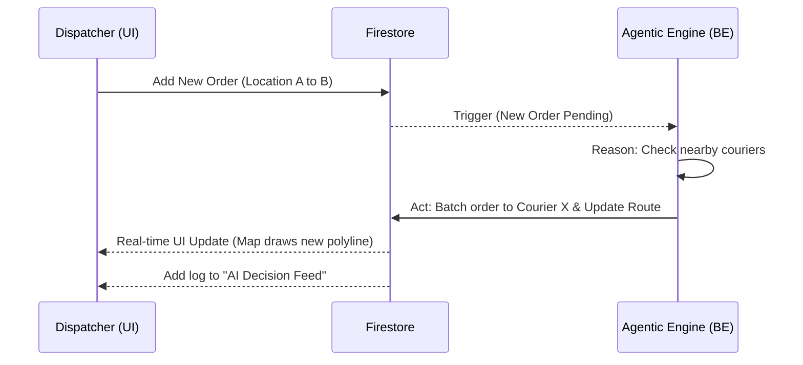
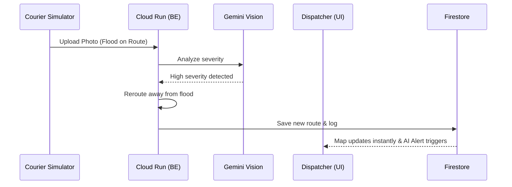

# User Flow & Wireframe UI Structure
**Project:** Pandu.ai
**Frontend Stack:** React.js, Tailwind CSS[cite: 1]

## Overview
This document outlines the user interaction paths and the high-level layout structure for the Pandu.ai frontend. It covers two main perspectives needed for the hackathon demonstration: the Dispatcher Dashboard (Main UI) and the Courier Simulator (Testing Tool).

---

## 1. User Flows

### Flow A: Dynamic Re-routing & Batching (Dispatcher View)


### Flow B: Multimodal Obstacle Report (Courier Simulator View)[cite: 1]


---

## 2. Wireframe Structure (Component Layout)

### A. Main View: Dispatcher Dashboard (Desktop)
*Layout strategy: CSS Grid / Flexbox (100vh full screen)*

**1. Top Navigation Bar (Header)**
*   **Left:** "Pandu.ai" Logo.
*   **Right:** System Status Indicator (e.g., "🟢 AI Engine Active", "Firestore Connected").

**2. Left Panel: Control & Overview (Width: ~25%)**
*   **Order Input Form:** Fields for Pickup Lat/Lng, Dropoff Lat/Lng, and "Dispatch" button.
*   **Active Couriers List:** Cards showing Courier Name, Current Status (Idle/Delivering), and Assigned Orders.

**3. Center Panel: Live Map View (Width: ~50%)**
*   **Map Container:** Google Maps iframe/component[cite: 1].
*   **Markers:** Courier locations (moving in real-time), Order Pickup/Dropoff pins.
*   **Polylines:** Visible routes connecting couriers to their destinations.

**4. Right Panel: AI Decision Log (Width: ~25%)**
*   **Title:** "Agent Activity Feed".
*   **Feed Items:** A scrollable list of logs (e.g., *[14:05] Agent batched Order #12 to Courier B*, *[14:12] Agent rerouted Courier A due to flood*).
*   **Alerts:** High-severity events flash red (Tailwind: `bg-red-100 border-red-500`).

---

### B. Floating Tool: Courier Simulator (Mobile Modal/Drawer)
*Purpose: A small UI overlaid on the dashboard specifically for the hackathon presentation to simulate a courier reporting an issue.*[cite: 1]

*   **Location Select:** Dropdown to select which courier is "reporting".
*   **Camera/Upload Input:** File input to upload an image of a road obstacle.
*   **Submit Button:** "Report to AI Dispatcher".

---

## 3. Tailwind CSS Implementation Guide (For FE Developer)

To build this quickly, use these foundational Tailwind classes for the main layout:
```jsx
// Main Layout Wrapper
<div className="flex h-screen w-full bg-gray-50 overflow-hidden">
  
  // Left Panel
  <aside className="w-1/4 h-full bg-white shadow-md p-4 flex flex-col gap-4 overflow-y-auto">
    
  </aside>

  // Center Map
  <main className="flex-1 relative">
    <GoogleMapComponent className="absolute inset-0 w-full h-full"/>
    
    // Courier Simulator Floating Button (Bottom Center)
    <button className="absolute bottom-6 left-1/2 -translate-x-1/2 bg-blue-600 text-white px-6 py-3 rounded-full shadow-lg">
      Simulate Courier App
    </button>
  </main>

  // Right Panel (AI Logs)
  <aside className="w-1/4 h-full bg-gray-900 text-white p-4 overflow-y-auto">
    <h2 className="text-xl font-bold mb-4">Agentic Engine Logs</h2>
    
  </aside>

</div>